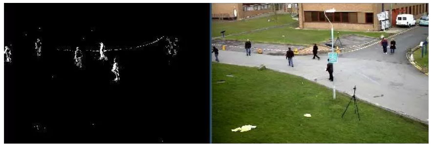

# Background modeling

This is Background modeling demo code.

## Install package

- pip install opencv-python==4.3.0.36
    
- pip install opencv-contrib-python==4.3.0.36

- ps：install version need equality.

## Frame difference (帧差法)

- 由于场景中的目标在运动，目标的影像在不同图像帧中的位置不同。
该类算法对时间上连续的两帧图像进行差分运算，不同帧对应的像素点相减，判断灰度差的绝对值，当绝对值超过一定阈值时，即可判断为运动目标，
从而实现目标的检测功能。

- 帧差法非常简单，但是会引入噪音和空洞问题

- 原理：

## Gaussian Mixture Model (混合高斯模型)
- Learning：[GaussianMixtureModel.py](./GaussianMixtureModel.py)

- 在进行前景检测前，先对背景进行训练，对图像中每个背景采用一个混合高斯模型进行模拟，每个背景的混合高斯的个数可以自适应。

- 然后在测试阶段，对新来的像素进行GMM匹配，如果该像素值能够匹配其中一个高斯，则认为是背景，否则认为是前景。

- 由于整个过程GMM模型在不断更新学习中，所以对动态背景有一定的鲁棒性。

- 最后通过对一个有树枝摇摆的动态背景进行前景检测，取得了较好的效果。

- 在视频中对于像素点的变化情况应当是符合高斯分布

- 背景的实际分布应当是多个高斯分布混合在一起，每个高斯模型也可以带有权重

### 混合高斯模型学习方法

- 1.首先初始化每个高斯模型矩阵参数。

- 2.取视频中T帧数据图像用来训练高斯混合模型。来了第一个像素之后用它来当做第一个高斯分布。

- 3.当后面来的像素值，与前面已有的高斯的均值比较，如果该像素点的值与其模型均值差在3倍的方差内，则属于该分布，并对其进行参数更新。

- 4.如果下一次来的像素不满足当前高斯分布，用它来创建一个新的高斯分布。

### 混合高斯模型测试方法

- 在测试阶段，对新来像素点的值与混合高斯模型中的每一个均值进行比较，如果其差值在2倍的方差之间的话，则认为是背景，否则认为是前景。

- 将前景赋值为255，背景赋值为0。这样就形成了一副前景二值图。

