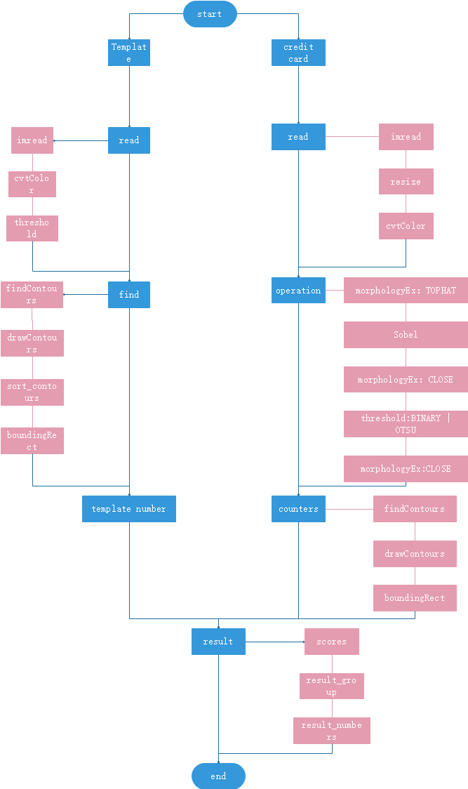

# Credit card number identification

This is a project to Credit card number identification.

## Install package

pip install imutils

## Project Introduce

We want to use the template number get credit card number.

Template number：

Credit card：

## Implementation approach

### Program introduce

Main program: [CreditCardOCR.py](CreditCardOCR.py)

Tools program: [CreditCardData](CreditCardData/)

Data source: [Utils.py](Utils.py)

### Content tree

windows cmd: tree [path] \f
        
    CreditCartNumberRecognition
        ├─ README.md
        ├─ CreditCardOCR.py
        ├─ myutils.py
        ├─ ocr_template_match.py
        ├─ Utils.py
        │
        ├─ CreditCardData
        │   ├─ credit_card_01.png
        │   ├─ credit_card_02.png
        │   ├─ credit_card_03.png
        │   ├─ credit_card_04.png
        │   ├─ credit_card_05.png
        │   ├─ ocr_a_reference.png

### Flow chart

