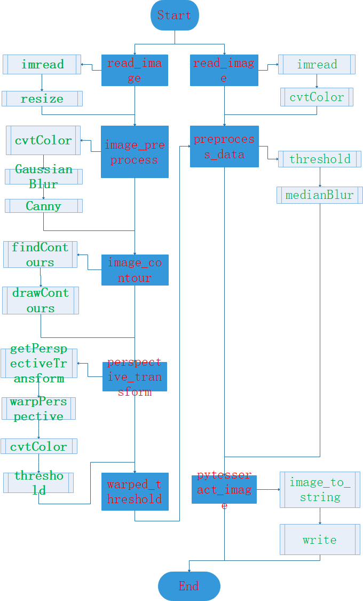

# Document Scanning Recognition OCR

This is Document OCR recognition test project.

## Install package

- pip install pillow==7.2.0

- pip install pytesseract==0.3.4

- pip uninstall opencv-python, pip install opencv-python==3.4.10.35

- pip uninstall opencv-contrib-python, pip install opencv-contrib-python==3.4.10.35

- PS: opencv version == 4.3.0.6 is error, must use low version opencv

## Install OCR Tools

1.Download link: [tesseract 4.0](https://digi.bib.uni-mannheim.de/tesseract/)

2.Install exe or dmg package.

3.Add system environment variable: Path:D:\Tesseract-OCR

4.Test CMD: tesseract -v

5.CMD use tesseract: tesseract XXX.png result.txt  # The OCR result output to result.txt

6.If error : pytesseract.pytesseract.TesseractNotFoundError: tesseract is not installed or it's not in your PATH

  then find the py file: xxx/Lib/site-packages/pytesseract/pytesseract.py
  
  change this tesseract_cmd = 'tesseract' to tesseract_cmd = r'D:\Tesseract-OCR\tesseract.exe'

7.If error: Error opening data file \Tesseract-OCR\eng.traineddata ......

  then look at the link: [resolve](https://blog.csdn.net/weixin_42812527/article/details/81908674)

  Add TESSDATA_PREFIX environment variable, TESSDATA_PREFIX: D:\Tesseract-OCR\tessdata

## Project Introduce

We need use Canny, findContours, Perspective Transform to preproccess,

then use tesseract OCR tools, get result text.

## Implementation approach

### Program introduce

Main program: [DocumentOCR.py](DocumentOCR.py)

Document source: [DocumentData](./DocumentData)

OCR data source: [OCRData](./OCRData)

OCR result source: [OCRResult](./OCRResult)

### Content tree
    
    DocumentScanningRecognition
        ├─  README.md
        ├─  DocumentOCR.py
        │
        ├─ DocumentData
        │   ├─  page.jpg
        │   ├─  receipt.jpg
        │
        ├─ OCRData
        │   ├─  scanDemo.jpg
        │
        └─ OCRResult

### Flow chart

