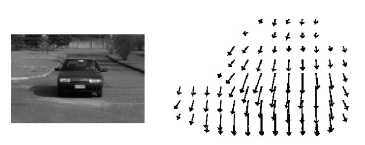
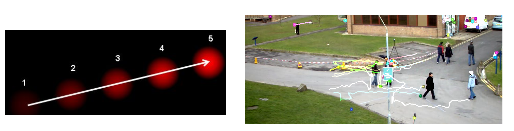
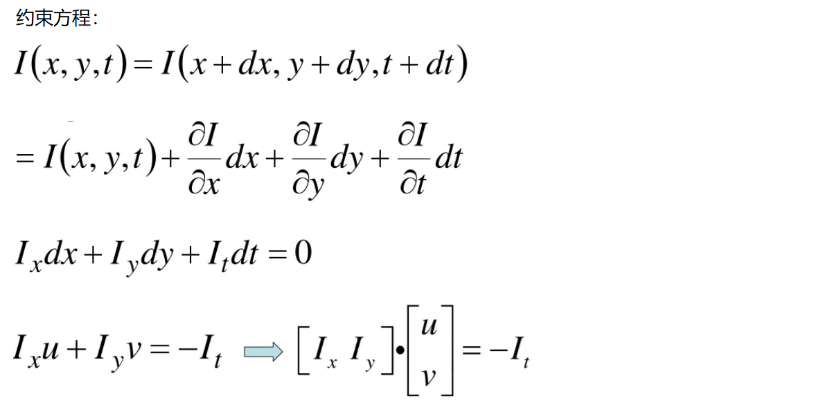
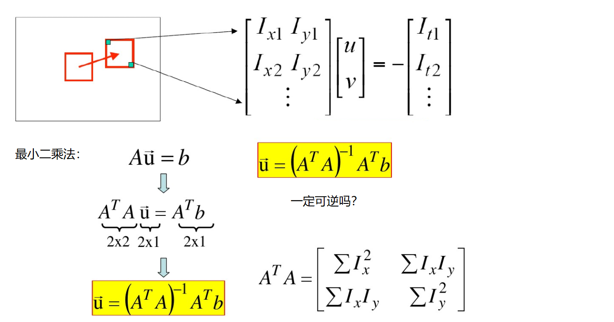

# Optical Flow Estimation

This is Optical Flow Estimation demo code.

## Install package

- pip install opencv-python==4.3.0.36
    
- pip install opencv-contrib-python==4.3.0.36

- ps：install version need equality.

## Optical Flow Estimation (光流估计)

- Learning：[OpticalFlow.py](./OpticalFlow.py)

- 光流是空间运动物体在观测成像平面上的像素运动的“瞬时速度”，根据各个像素点的速度矢量特征，
可以对图像进行动态分析，例如目标跟踪。

- 亮度恒定：同一点随着时间的变化，其亮度不会发生改变。

- 小运动：随着时间的变化不会引起位置的剧烈变化，
只有小运动情况下才能用前后帧之间单位位置变化引起的灰度变化去近似灰度对位置的偏导数。

- 空间一致：一个场景上邻近的点投影到图像上也是邻近点，且邻近点速度一致。
因为光流法基本方程约束只有一个，而要求x，y方向的速度，有两个未知变量。
所以需要连立n多个方程求解。

## Lucas-Kanade Algorithm

- [Video Tracking Lucas-Kanade.pdf](./Data/Video Tracking Lucas-Kanade.pdf)

- wikipedia link: [Lucas–Kanade method](https://en.wikipedia.org/wiki/Lucas%E2%80%93Kanade_method)

- 如何求解方程组呢？看起来一个像素点根本不够，在物体移动过程中还有哪些特性呢？

## cv2.calcOpticalFlowPyrLK()

参数：

- prevImage 前一帧图像

- nextImage 当前帧图像

- prevPts 待跟踪的特征点向量

- winSize 搜索窗口的大小

- maxLevel 最大的金字塔层数

返回：

- nextPts 输出跟踪特征点向量

- status 特征点是否找到，找到的状态为1，未找到的状态为0

