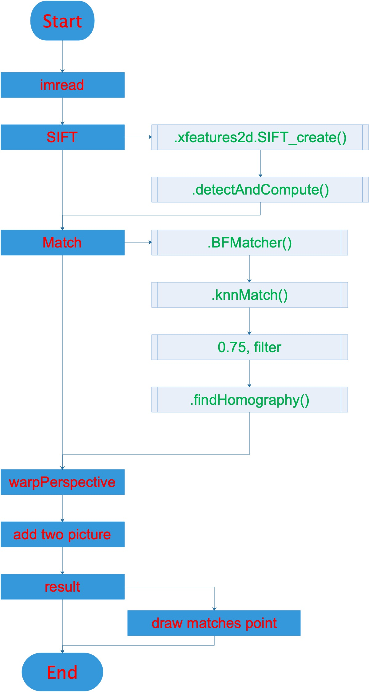

# Panoramic image mosaic

This is Panoramic image mosaic test project.

## Project Introduce

We need use picture feature matching method, 
get the finally Panoramic picture of left and right picture.

## Implementation approach

### Program introduce

Main program: [ImageJoining.py](ImageJoining.py)

Tool class: [Joiner.py](Joiner.py)

Data source: [Data](./Data)

### Content tree
    
    
    PanoramicImageMosaic
        ├── Data
        │   ├── left_01.png
        │   └── right_01.png
        ├── ImageJoining.py
        ├── Joiner.py
        └── README.md

### Flow chart

