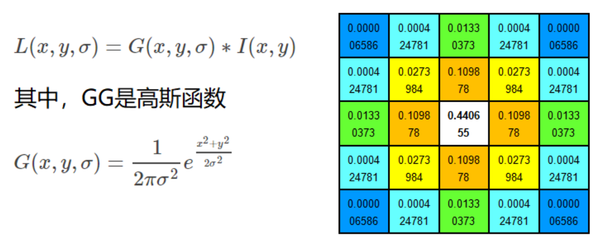
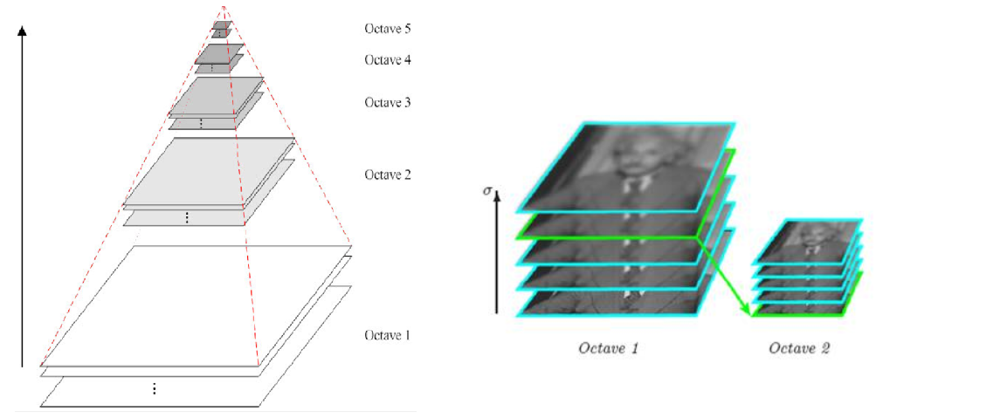
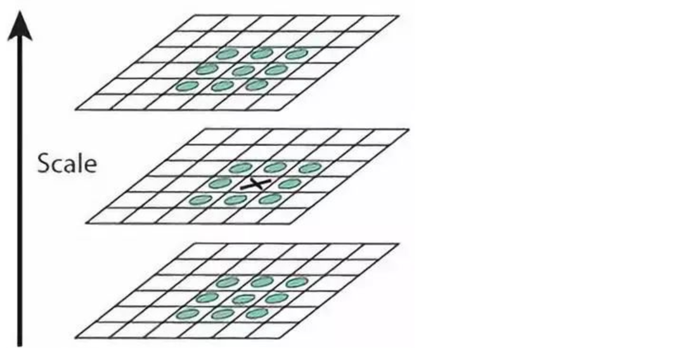
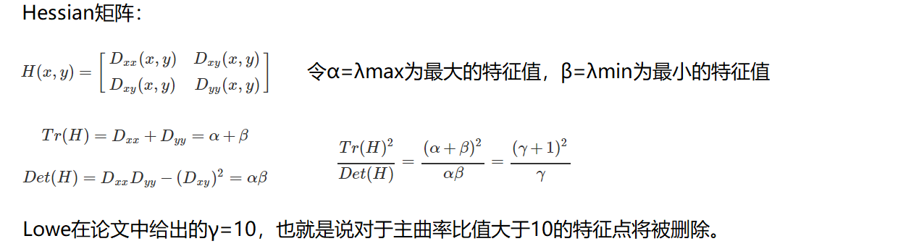

# README

- This is include some picture feature algorithm.

## Picture feature

#### Harris algorithm

- Learning: [HarrisAlgorithm.py](HarrisAlgorithm.py)

- what is the Edge? Corner? Flat?

- Principle

#### SIFT algorithm

- Learning: [HarrisAlgorithm.py](HarrisAlgorithm.py)

- link:
    
    [CSDN:SIFT(Scale Invariant Feature Transform)](https://blog.csdn.net/zaishuiyifangxym/article/details/93656603)
    
    [wikipedia:Scale-invariant feature transform](https://en.wikipedia.org/wiki/Scale-invariant_feature_transform)

-  what is SIFT ?

    Scale Invariant Feature Transform（SIFT）: 尺度不变特征变换匹配算法

    
- What is scale space ? (图像尺度空间)
    
    在一定的范围内，无论物体是大还是小，人眼都可以分辨出来，然而计算机要有相同的能力却很难，所以要让机器能够对物体在不同尺度下有一个统一的认知，
    就需要考虑图像在不同的尺度下都存在的特点。
    
    尺度空间的获取通常使用高斯模糊来实现.
    
    不同σ的高斯函数决定了对图像的平滑程度，越大的σ值对应的图像越模糊。
    
    
    
    

- Multiresolution pyramid ? (多分辨率金字塔)

    

- Gaussian difference pyramid (DOG) ? (高斯差分金字塔)

    

    

- DOG Spatial extremum detection ? (DOG 空间极值检测)

    为了寻找尺度空间的极值点，每个像素点要和其图像域（同一尺度空间）和尺度域（相邻的尺度空间）的所有相邻点进行比较，当其大于（或者小于）所有相邻点时，
    该点就是极值点。如下图所示，中间的检测点要和其所在图像的3×3邻域8个像素点，以及其相邻的上下两层的3×3领域18个像素点，共26个像素点进行比较。
    
    

- Accurate positioning of key points  ? (关键点的精确定位)

    这些候选关键点是DOG空间的局部极值点，而且这些极值点均为离散的点，精确定位极值点的一种方法是，对尺度空间DoG函数进行曲线拟合，
    计算其极值点，从而实现关键点的精确定位。

    

    

- Eliminating Edge Responses? (消除边界响应)

    

- Orientation Assignment? (特征点主方向)

    每个特征点可以得到三个信息(x,y,σ,θ)，即位置、尺度和方向。具有多个方向的关键点可以被复制成多份，然后将方向值分别赋给复制后的特征点，
    一个特征点就产生了多个坐标、尺度相等，但是方向不同的特征点。
    
    

- The Local Image Descriptor? (生成特征描述)

    在完成关键点的梯度计算后，使用直方图统计邻域内像素的梯度和方向。
    
    
    
    为了保证特征矢量的旋转不变性，要以特征点为中心，在附近邻域内将坐标轴旋转θ角度，即将坐标轴旋转为特征点的主方向。

    
    
    旋转之后的主方向为中心取8x8的窗口，求每个像素的梯度幅值和方向，箭头方向代表梯度方向，长度代表梯度幅值，然后利用高斯窗口对其进行加权运算，
    最后在每个4x4的小块上绘制8个方向的梯度直方图，计算每个梯度方向的累加值，即可形成一个种子点，即每个特征的由4个种子点组成，每个种子点有8个方向的向量信息。

    

    论文中建议对每个关键点使用4x4共16个种子点来描述，这样一个关键点就会产生128维的SIFT特征向量。 

    

