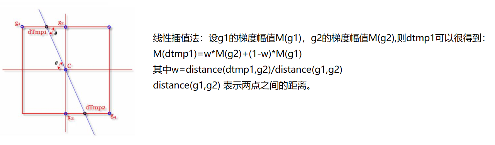
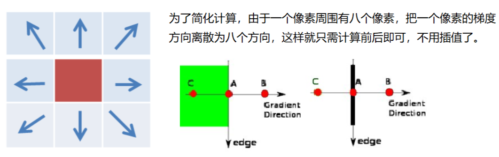
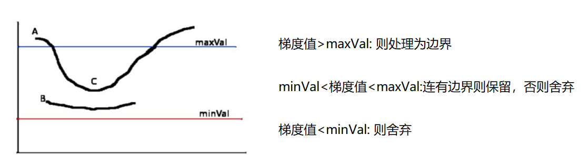

# README
- This is include some picture processing.

## Picture Processing

#### review BGR format, gray picture and HSV format 
    
    
[BGRGrayHSV.py](BGRGrayHSV.py)

#### Image threshold

[ImageThreshold.py](ImageThreshold.py)

#### Image filtering

Learning：
    mean filtering（均值滤波）、
    box filtering（方框滤波）、
    gaussianBlur filtering（高斯滤波）、
    medianBlur filtering（中值滤波）

[ImageFiltering.py](ImageFiltering.py)

#### Image morphology

Learning：
    erode（腐蚀）、
    dilate（膨胀）、
    morphologyEx：MORPH_OPEN（开运算）、
    morphologyEx：MORPH_CLOSE（闭运算）、
    morphologyEx：MORPH_GRADIENT（梯度运算）、
    morphologyEx：MORPH_TOPHAT（礼帽运算）、
    morphologyEx：MORPH_BLACKHAT（黑帽运算）
    
[ImageMorphology.py](ImageMorphology.py)

#### Image Gradient

Learning：
    [ImageGradientSobel.py](ImageGradientSobel.py)
    
Sobel（Sobel算子）    

Learning：
[ImageGradientScharrAndLaplacian.py](ImageGradientScharrAndLaplacian.py)

Scharr（Scharr算子（沙尔））

Laplacian（Laplacian算子）

    
    
    
#### Image Edge detection

learning: 
    [ImageCannyEdgeDetection.py](ImageCannyEdgeDetection.py)
    
Canny Edge detection (Canny 边缘检测)

1)gaussianBlur filtering (使用高斯滤波器，以平滑图像，滤除噪声。)

Apply Gaussian filter to smooth the image in order to remove the noise

2)Sobel (计算图像中每个像素点的梯度强度和方向。)

Find the intensity gradients of the image

3)NMS (应用非极大值（Non-Maximum Suppression）抑制，以消除边缘检测带来的杂散响应。)

Apply non-maximum suppression to get rid of spurious response to edge detection

4)Double-Threshold (应用双阈值（Double-Threshold）检测来确定真实的和潜在的边缘。)

Apply double threshold to determine potential edges

5)通过抑制孤立的弱边缘最终完成边缘检测。

Track edge by hysteresis: Finalize the detection of edges by suppressing all the other edges that are weak and not connected to strong edges.

#### Image Pyramid

learning: [ImagePyramid.py](ImagePyramid.py)

Gaussian Pyramid (高斯金字塔)

Down 向下采样方法（缩小）

Up 向上采样方法（放大）

Laplacian Pyramid(拉普拉斯金字塔)

#### Image Contour

learning: [ImageContour.py](ImageContour.py)

#### Image template matching

learning: [ImageTemplateMatching.py](ImageTemplateMatching.py)

link: [matchTemplate](https://docs.opencv.org/3.3.1/df/dfb/group__imgproc__object.html#ga3a7850640f1fe1f58fe91a2d7583695d)

#### Image Histogram

learning: 

#### Image Fourier transform

learning: 

