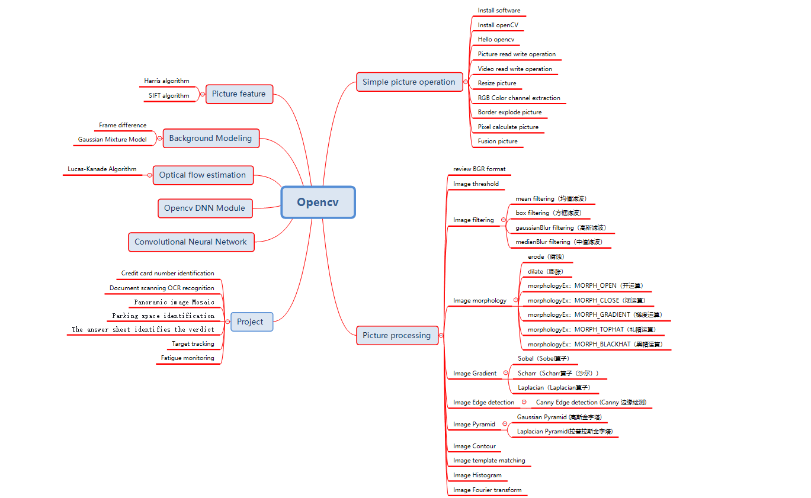

# README

This is a Opencv guide.

I hope to help you! 

## Start

- clone project
  
  
    git clone https://github.com/Kate-liu/Opencv.git

- Simple picture operation

    [PictureBaseOperation](PictureBaseOperation/README.md)
    
- Picture processing

    [PictureProcessing](PictureProcessing/README.md)

- Picture feature
  
    [PictureFeature](PictureFeature/README.md)

- Background Modeling

    [BackgroundModeling](BackgroundModeling/README.md)

- Optical flow estimation

    [OpticalFlowEstimation](OpticalFlowEstimation/README.md)

- Opencv DNN Module
  
    [OpencvDNNModule](OpencvDNNModule/README.md)

- Convolutional Neural Network (CNN)

    [ConvolutionNeuralNetwork](ConvolutionNeuralNetwork/README.md)
    
- Other guides
(wait sometimes......)

## Project

1.[Credit card number identification](CreditCardNumberRecognition/README.md)

2.[Document scanning OCR recognition](DocumentScanningRecognition/README.md)

3.[Panoramic image Mosaic](PanoramicImageMosaic/README.md)

4.[Parking space recognition](ParkingSpaceRecognition/README.md)

5.[The answer sheet identifies the verdict](AnswerSheetRecognition/README.md)

6.[Target tracking](TargetTracking/README.md)

7.[FaceShapePredictor](FaceShapePredictor/README.md)

## Tools
- Pycharm：https://www.jetbrains.com/pycharm/
  
- Anaconda：https://www.anaconda.com/
  
- Git：https://git-scm.com/

- Tesseract： https://digi.bib.uni-mannheim.de/tesseract/

## Tutorials
- OpenCV-Python Tutorials：https://opencv-python-tutroals.readthedocs.io/en/latest/py_tutorials/py_tutorials.html

- opencv-python：https://pypi.org/project/opencv-python/

